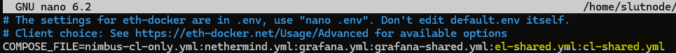

# Rewards & bonds (WIP)

## Dashboard

<figure><figcaption></figcaption></figure>

### How to get here

* Go to the CSM Web App (link)
* Select the `BOND & REWARDS` section in the navigation bar

### `CLAIM` tab

Here, you will see your net rewards and bond claimable in aggregate and broken down into it's individual parts. Notice that `Locked bond` is also deducted from your aggregate rewards here.

You will also be able to claim your net rewards + bond in total or in individual parts if you wish, and select among 3 token types to receive--ETH/stETH/wstETH.

### `ADD BOND` tab

<figure><figcaption></figcaption></figure>

There are 2 activities you can perform here:

1. Review the balance of your total bond provided and the excess/shortage bond amounts
2. Add more bond so that you can get more of your uploaded validator keys funded by the CSM

Once your excess bond amount is sufficient for new validator keys to be funded, the `Keys available to upload` will increase.

<figure><figcaption></figcaption></figure>

On the other hand, if your bond shortage falls below the required minimum, the unbonded keys count will increase.

<figure><figcaption></figcaption></figure>


The required minimum bond amount is based on how many of your uploaded validator keys have been funded by the CSM.


**At this point, there are 3 options you can take:**

1. Top up your bond amount&#x20;
2. Wait for new rewards to replenish the bond  amount until it is back to the required level
3. Exit some of your CSM-funded validator keys

### `UNLOCK BOND` tab

<figure><figcaption></figcaption></figure>

This tab allows you to replenish your `Locked bonds`.
