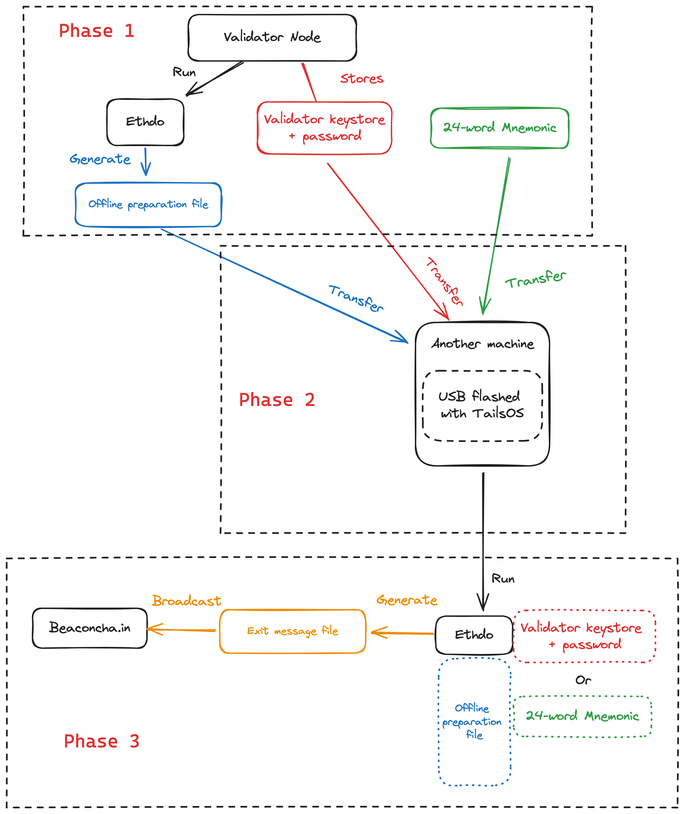

# Proper Exits

## Manual exit

Exiting CSM-deposited validator keys works the same way as exiting solo staking validator keys.

Refer to this dedicated guide for exiting validators put together by Remy Roy.



You can also follow the steps extracted from Remy's guide below (Linux only).

### Overview of the validator exit process

The whole process can feel daunting so we will break it down into 3 phases.

<figure><figcaption></figcaption></figure>

### Phase 1: Prepare the necessary files

* Ensure that you have either your **24-word mnemonic** or your **validator keystores + the password to decrypt it.**&#x20;


If you have neither, you will likely never be able to exit your validators, so keep both items secure!


* Download the latest version of [`ethdo`](https://github.com/wealdtech/ethdo/releases)&#x20;

```sh
cd
wget https://github.com/wealdtech/ethdo/releases/download/v1.35.3/ethdo-1.35.3-linux-amd64.tar.gz
wget https://github.com/wealdtech/ethdo/releases/download/v1.35.3/ethdo-1.35.3-linux-amd64.tar.gz.sha256
```

* Print the sha256 checksum

```
cat ethdo-1.35.3-linux-amd64.tar.gz.sha256
```

* Verify the checksum of the downloaded zipped file using the output of the previous command.

```sh
echo "<sha256_checksum> ethdo-1.35.3-linux-amd64.tar.gz" | sha256sum --check
```

**Expected output:**

```
ethdo-1.35.3-linux-amd64.tar.gz: OK
```


Do not proceed if the checksum verification fails, and reach out for help on the Lido or Ethstaker discord.&#x20;


* Generate the `offline-preparation.json` file using `ethdo`

```sh
tar xvf ethdo-1.35.3-linux-amd64.tar.gz
./ethdo validator exit --prepare-offline
```

**Expected output:**

```
offline-preparation.json generated
```

### Phase 2: Transfer files into an air-gapped machine

Recall the steps in the **Install and prepare the OS** section, but instead of installing Ubuntu as the OS, we will install TailsOS for extra security.

* Prepare 2 brand new USB drives
* Plug the _**first**_ USB drive into your validator node machine and identify the USB drive on your terminal&#x20;

```sh
lsblk
# Look for your USB drive in the output list. 
# It will take a name similar to "sdx1". 
```

* After you find it, you can proceed to mount this _**first**_ USB drive onto the `/media` folder

```sh
sudo mount /dev/sda1 /media 
#Replace sda1 with the actual name of your USB drive.
```

* Load your validator keystores, the downloaded ethdo zipped file, the sha256 checksum, and the offline-preparation.json file into the _**first**_ USB drive

```
sudo cp <file_path_to_validator_keystores> /media
sudo cp ~/offline-preparation.json ~/ethdo-1.35.3-linux-amd64.tar.gz ~/ethdo-1.35.3-linux-amd64.tar.gz.sha256 /media
```

* Download the latest version of TailsOS into your laptop from the [website](https://tails.net/install/mac/index.en.html#download) and follow the instructions to upload the downloaded file for checksum verification
* **This step creates the airgapped machine:** Unplug any wired connections from your laptop. Then, follow the steps in the [**Install and prepare the OS**](../../../linux-os-networking-and-security/install-and-prepare-the-os.md) section to flash the _**second**_ USB drive with TailsOS and boot up TailsOS on your laptop. Stop just before _"**Install the SSH server"**_
* Plug the _**first**_ USB drive into your laptop that is now running TailsOS and transfer all the files into the home folder

### Phase 3: Signing the exit message

**Loading the files onto TailsOS**

* Open up the terminal on TailsOS
* Print the sha256 checksum

```sh
cd
cat ethdo-1.35.3-linux-amd64.tar.gz.sha256
```

* Verify the checksum of the downloaded zipped file using the output of the previous command.

```sh
echo "<sha256_checksum> ethdo-1.35.3-linux-amd64.tar.gz" | sha256sum --check
```

**Expected output:**

```
ethdo-1.35.3-linux-amd64.tar.gz: OK
```


Do not proceed if the checksum verification fails, and seek help on the Lido or Ethstaker discord.&#x20;


* Extract the ethdo file

```sh
tar xvf ethdo-1.35.2-linux-amd64.tar.gz
```

**Generate the exit message (Choose your method)**

* **Method 1:** Using the validator keystores + password

```sh
./ethdo validator exit --validator="KEYSTORE_FILENAME" --passphrase='KEYSTORE_PASSWORD' --json --offline > RESULTING_FILENAME

#Example:
#./ethdo validator exit --validator="KEYSTORE_FILENAME" --passphrase='KEYSTORE_PASSWORD' --json --offline > RESULTING_FILENAME
```

* **Method 2:** Using the 24-word mnemonic

```sh
./ethdo validator exit --validator=VALIDATOR_INDEX --json --offline --mnemonic="MNEMONIC" > RESULTING_FILENAME

#Example:
#./ethdo validator exit --validator=459921 --json --offline --mnemonic="silent hill auto ability front sting tunnel empower venture once wise local suffer repeat deny deliver hawk silk wedding random coil you town narrow" > 459921-exit.json
```

Copy the resulting file (e.g., 459921-exit.json) into your _**first**_ USB (currently plugged into your TailsOS laptop). This is the `exit message`.


**WARNING:** Do not enter your 24-word mnemonic into any machine that is not air-gapped _(i.e., never was and never will be online)_


**Broadcasting the exit message**

* Restart your TailsOS laptop and unplug the _**second**_ USB flashed with TailsOS to revert to your normal operating system


All files that were previously copied onto TailsOS will be wiped automatically upon restart or shut down


* Browse to [https://beaconcha.in/tools/broadcast](https://beaconcha.in/tools/broadcast), upload your `exit message` into the widget and broadcast it

Your validator will now enter the exit queue. You must keep your validator node running until it is fully exited, or you will suffer offline penalties.

<details>

<summary>Automated exit (WIP, do not use)</summary>

Because exit requests need to be fulfilled within 96 hours, CSM operators can choose to run a service called the `validator-ejector` to automate this process.

#### Using the `validator-ejector` package

Download the [latest git repository](https://github.com/lidofinance/validator-ejector) of `validator-ejector`.

```sh
cd
git clone https://github.com/lidofinance/validator-ejector.git
cd validator-ejector
```

Create the environment file and open it up for editing.

```sh
sudo cp sample.env .env
sudo nano .env
```

Replace the following environment variables in the .env file with the details below.

```
EXECUTION_NODE=http://<Internal_IP_Address>:<RPC_Port>
CONSENSUS_NODE=http://<Internal_IP_Address>:<REST_Port>
LOCATOR_ADDRESS=0x1eDf09b5023DC86737b59dE68a8130De878984f5
STAKING_MODULE_ID=1
OPERATOR_ID=123

MESSAGES_LOCATION=messages
MESSAGES_PASSWORD=pass


```

</details>
