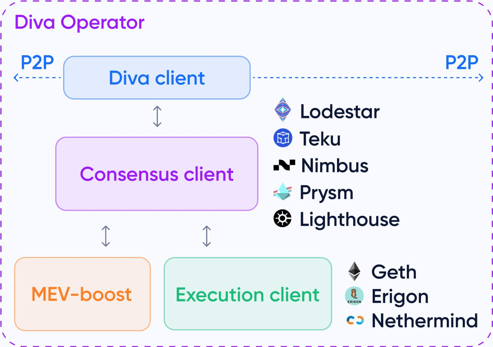

# Default - All-in-one setup

## Overview

1. You will be running a series of docker containers that collective forms the Diva service with the command: `docker compose up -d`
   * [Diva client](https://hub.docker.com/r/diva/diva) written in Golang
   * A Prysm validator client
   * A Prysm consensus client&#x20;
   * A Geth execution client
   * [Reloader script](https://hub.docker.com/r/diva/reloader) service that syncs the public keys between the validator client and Diva
   * [Diva Operator](https://hub.docker.com/r/diva/operator-ui) web UI for the Diva client API
   * [Prometheus](https://prometheus.io/), [Grafana](https://grafana.com/), [Jaeger](https://www.jaegertracing.io/) and [Vector](https://vector.dev/) for monitoring the testnet
2. The system instructions for running the above is captured in the `docker-compose.yml` and `.env`files of the git repository you will be downloading
3. Open the ports used by the Diva service on your device&#x20;
4. &#x20;The Diva client comes together with a Prysm validator client - indicated as "Diva client" in the diagram below. Together, they sit on top of and connects to your execution + consensus client set via the , replacing the need for you to run your own validator client for this purpose
5. You will configure this connection via the `.env` file

<figure><figcaption></figcaption></figure>


For this method, you will need to stop your existing execution & consensus client and run the Prysm validator + consensus and Geth execution clients via the Docker containers included in the Diva Staking service stack.


## Installing dependencies - Docker

It is recommended to run the Diva service from a Docker container. To do that, we first have to install Docker - the script below performs the following:

1. Download and run the official Docker installation script
2. Creates a new user group called "docker"
3. Adds your current Linux user account to this new docker group

```sh
curl -fsSL https://get.docker.com -o get-docker.sh
sudo sh get-docker.sh

sudo groupadd docker
sudo usermod -aG docker $USER
```

Log out and then back in again for the new user group settings to take effect.

```sh
exit
```

```sh
ssh <user>@<IP_address> -p <port_no.> -i <SSH_key> -v
```


An automated option is provided by Diva Staking [here](https://docs.shamirlabs.org/diva/testnet/install/scripts/docker). However, we highly recommend going through the manual process for a maximum learning outcome.


## Installing the Diva client

First, make sure your OS is up to date by running general updates.

```sh
sudo apt update -y && sudo apt upgrade -y
```

Next, download the latest Diva Staking repository (testnet) here - [https://github.com/shamirlabs/diva-alpha-net](https://github.com/shamirlabs/diva-alpha-net) - by running:

```shell
cd
git clone https://github.com/shamirlabs/diva-alpha-net.git
```


An automated option is provided by Diva Staking [here](https://docs.shamirlabs.org/diva/testnet/install/scripts/diva). However, we highly recommend going through the manual process for a maximum learning outcome.


## Preparing the Docker environment (.env) file

Now, enter into the directory, rename the .env.example file to .env, and then open it up for editing.

```sh
cd diva-alpha-net
sudo mv .env.example .env
sudo nano .env
```

#### Make the following changes:

1\) Amend the COMPOSE\_FILE and COMPOSE\_PROFILES to the following values. This will enable metrics for monitoring and telemetry for the Diva team to help you with troubleshooting.

```
COMPOSE_FILE=docker-compose.yml # Change this (docker compose file name)
COMPOSE_PROFILES=clients,metrics,telemetry # Change this (docker profiles: clients, metrics, telemetry)
```

2\) Connect your Diva client to your execution client via WebSocket&#x20;

Replace the value `ws://HOST_IP:PORT` of `EXECUTION_CLIENT_URL` with the WebSocket endpoint of your execution client.

```
EXECUTION_CLIENT_URL=ws://geth:8546  # Change this (execution RPC WebSocket, Nethermind example: ws://HOST_IP:8545)
```

**\*Note:** You have to use the IP address assigned by your ethernet port (eth0) or Wifi (wlo1) and not the loopback address (127.0.0.1) here.

3\) Connect your Diva client to your Prysm consensus client via REST API

Replace the value `http://HOST_IP:PORT` of `CONSENSUS_CLIENT_URL` with the REST API provider endpoint of your consensus client.

```
CONSENSUS_CLIENT_URL=http://beacon:3500  # Change this (consensus REST API, prysm example: http://HOST_IP:3500)
```

Replace the value `HOST_IP:PORT` of the `BEACON_RPC_PROVIDER` with the RPC provider endpoint of your consensus client.

```
BEACON_RPC_PROVIDER=beacon:4000 # Change this (consensus RPC, prysm example: http://HOST_IP:4000)
```

4\) Choose a strong password to log into your Diva node API.

```
DIVA_API_KEY=changeThis  # Change this (API key for the operator UI)
```

5\) Choose another strong password to encrypt the database of your node. This will also be useful for restoring your node in the future.

**\*Note:** Once this parameter is set during the first start-up of the node, you won't be able to change it until such functionality is implemented. For that reason we recommend that you back it up in a safe place.

```
DIVA_VAULT_PASSWORD=vaultPassword # Change this (password for the encrypted vault)
```

6\) Set a username for the logs to help developers debug issues you might find. You can choose any username you'd like, but we recommend you use the Discord username so we can reach out to you more efficiently if necessary..

Replace the value `discordusername-operatoraddress` of the `TESTNET_USERNAME` with the discord username that you want to use in the testnet and your operator address (for instance, `prada-0x0000000000000000000000000000000000000000`). This information is only available to the Shamir Labs development team and is not publicly available. It could be used to contact testnet participants if the team needs debugging information (such as logs), a database file, or to communicate an important patch/update.

Your username has no functional importance and is purely to label your node with a human-readable name.

```
TESTNET_USERNAME=discordusername-operatoraddress  # Change this (recommended to discord username and ethereum address of the operator)
```

Save your changes and exit by pressing `CTRL+O, ENTER, & CTRL+X`

## Open required ports

Your Diva client needs to talk to other nodes in order to perform signatures, receive duties, and find peers.&#x20;

As such, the following port configurations are needed.

1. Port `5050` used for P2P communication **MUST** be open on your machine and exposed to the public internet
2. Port `80` is used by the Operator UI and you **SHOULD** open it if you want to serve the Operator UI
3. Port `30000` is used to access the swagger API of your node and you **SHOULD** keep it open if you want to use the Operator UI

#### Open ports on your firewall rules

```sh
sudo ufw allow 5050
sudo ufw allow 80
sudo ufw allow 30000
```

If you are running a machine on a local network, remember to also configure port forwarding on your router to port 5050 on your node. Refer to the port forwarding section on how to do this.


[advanced-networking.md](../../tips/advanced-networking.md)


## Run the Diva client

After editing the `.env` file, you can now fire up the Diva Staking service using docker.

```sh
cd ~/diva-alpha-net
docker compose up -d
```

**\*Note:** Make sure you are in the same directory as where the `docker-compose.yml` file is. By default, this is in the `diva-alpha-net` directory.

Monitor the logs of the Diva service container:

```sh
docker logs -f diva
```

**Expected output:** There are 3 things to look out for - "connected to execution client", "consensus client available", and "running diva client".

<figure><figcaption></figcaption></figure>

**Note:** There will be a warning that says "cannot start p2p network without identity". This is expected as your Diva node is yet to be registered at this point.

## Troubleshooting

If you encounter any errors, perform the following steps sorted by priority to troubleshoot:

1\)  Check your `.env` files to make sure that all of your input details are correct. Check against the configuration files of your execution and consensus clients.&#x20;

Then, restart the docker containers.

```sh
docker restart $(docker ps -a -q)
```

2\) Stop and remove the docker containers. Then repeat the steps on this page.

```sh
docker rm -f $(docker ps -a -q)
```

3\) Perform (2) + delete the Diva git repository. Then repeat the steps on this page.

```sh
cd
sudo rm -r diva-alpha-net
```
