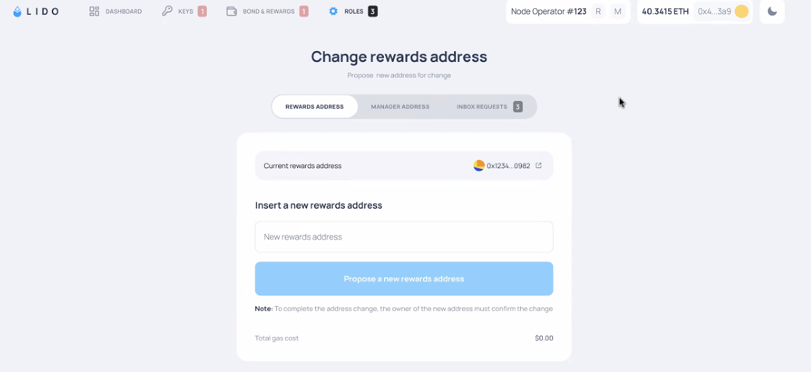

# SSV Operator

## Credits

This guide references the ideas and work of one of the Lido Community Staking members, [@ivans\_music](https://x.com/ivans\_music). _**Check out his original work below!**_



## Hardware (Holesky)

Spin up a virtual machine on a cloud service with the following specifications using the reference page below.

* CPU: 4 cores
* RAM: 16GB
* SSD: 250GB
* OS: Ubuntu 24.04


[practicing-on-cloud-vms.md](../../hardware-and-systems-setup/assemble-your-hardware/practicing-on-cloud-vms.md)



**Tip:** Open these reference pages in a new tab/window so that you can switch between them easily


## Installing ETH Docker

Each cluster member will need to spin up an SSV node using ETH Docker. Refer to the page below to install it. Come back to this page right before the `ethd config` command is run,


[eth-docker.md](../../automation-tools/eth-docker.md)


```
ethd config
```

**Follow along the prompts in the terminal UI (TUI) to:**

* Choose `Holešovice Testnet` >> `SSV node - consensus, execution and ssv-node`
* Select `yes` for _**Do you want to participate in DKG ceremonies as an operator?**_
* Once you see the screen below, select `<Cancel>` as we don't have our Operator ID yet.&#x20;

<figure><figcaption></figcaption></figure>

* _<mark style="background-color:yellow;">**Then copy your SSV node public key from your terminal output and save it on a text editor**</mark>_

<figure><figcaption></figcaption></figure>

<details>

<summary>ETH Docker TUI Navigation</summary>

* `Arrow keys & Tab key`: Cycle options

<!---->

* `Space bar`: Select option

<!---->

* `Enter`: Confirm option

<!---->

* `CTRL+C`: Exit individual screen monitoring view

<!---->

* `ESC`: Quit

</details>

## Register SSV Operator

1. Go to the [SSV webapp](https://app.ssv.network/join), connect your wallet, and set the network to Holesky.
2. Select `Join as Operator` >> `Register Operator`
3. Paste your SSV node public key into the `Operator Public Key` field. Make sure there are no whitespaces in your pasted string.
4. Keep `Operator Status` to _**Public**_
5. Set the annual fee to **1.5 SSV** per validator key, representing \~1.5% staking rewards fee at current $ETH and $SSV prices ($2650 & $23).
6. Register operator and sign the transaction on your wallet
7. Your SSV Operator ID will then be generated. _<mark style="background-color:yellow;">**Copy it and save it in a text editor file.**</mark>_

<figure><figcaption></figcaption></figure>


Setting your Operator Status to Public allows other stakers to select your SSV node as one of their DV operators, allowing them to pay you for your service. You can also easily net off the fees among your own DVT cluster members if you wish.&#x20;


## Complete ETH Docker Setup

Go back to the terminal of your VM.

```
ethd config
```

1. Choose `Holešovice Testnet` >> `SSV node - consensus, execution and ssv-node`
2. Select `yes` for _**Do you want to participate in DKG ceremonies as an operator?**_
3. Because you now have your `SSV Operator ID`, you can paste it in the requested field
4. Select the **consensus** and **execution client** of your choice
5. Use the `provided URL` for **Checkpoint Sync**, select `yes` for **MEV Boost**, `yes` for **Grafana dashboards**
6. Set `Rewards Address` to an ERC-20 wallet address that you control (e.g., Metamask, hardware wallet)
7. `use default` **Graffiti**, `yes` for **generate validator keys**

### Customise ETH Docker Settings

Open up the ETH Docker `.env` file for editing.

```sh
nano ~/eth-docker/.env
```

#### Add all MEV Relays

Add `#`to the start of the `MEV_RELAYS=` line.

<figure><figcaption></figcaption></figure>

Copy the string below and paste it in the next line, under the current  `#MEV_RELAYS=` line.

```
MEV_RELAYS=https://0xafa4c6985aa049fb79dd37010438cfebeb0f2bd42b115b89dd678dab0670c1de38da0c4e9138c9290a398ecd9a0b3110@boost-relay-holesky.flashbots.net,https://0xaa58208899c6105603b74396734a6263cc7d947f444f396a90f7b7d3e65d102aec7e5e5291b27e08d02c50a050825c2f@holesky.titanrelay.xyz,https://0x821f2a65afb70e7f2e820a925a9b4c80a159620582c1766b1b09729fec178b11ea22abb3a51f07b288be815a1a2ff516@bloxroute.holesky.blxrbdn.com,https://0xb1559beef7b5ba3127485bbbb090362d9f497ba64e177ee2c8e7db74746306efad687f2cf8574e38d70067d40ef136dc@relay-stag.ultrasound.money,https://0xab78bf8c781c58078c3beb5710c57940874dd96aef2835e7742c866b4c7c0406754376c2c8285a36c630346aa5c5f833@holesky.aestus.live,http://0x821f2a65afb70e7f2e820a925a9b4c80a159620582c1766b1b09729fec178b11ea22abb3a51f07b288be815a1a2ff516@testnet.relay-proxy.blxrbdn.com:18552,https://0x833b55e20769a8a99549a28588564468423c77724a0ca96cffd58e65f69a39599d877f02dc77a0f6f9cda2a3a4765e56@relay-holesky.beaverbuild.org,https://0xb1d229d9c21298a87846c7022ebeef277dfc321fe674fa45312e20b5b6c400bfde9383f801848d7837ed5fc449083a12@relay-holesky.edennetwork.io,https://0xaa58208899c6105603b74396734a6263cc7d947f444f396a90f7b7d3e65d102aec7e5e5291b27e08d02c50a050825c2f@holesky.titanrelay.xyz
```


This enables your SSV Node to use all MEV Relays which maximises MEV rewards for stakers using SSV.


#### Change SSV DKG Port

Change the `SSV_DKG_PORT=` to **443** (from 3030).

<figure><figcaption></figcaption></figure>

`CTRL+O`, `ENTER`, `CTRL+X` to save and exit.

## Configure DKG endpoint

Find the external IP address of your VM on your Google Cloud account >> Console >> Compute Engine >> Look under "External IP".

Your **DKG endpoint** will be `<EXTERNAL_IP_ADDRESS>:443`,without the pointy brackets. _<mark style="background-color:yellow;">**Note that down and save it in a text editor file.**</mark>_

<details>

<summary>Configure DKG endpoint (for non-VMs)</summary>

On your laptop, create a Tailscale VPN account at [https://login.tailscale.com](https://login.tailscale.com).

On your VM, install Tailscale and run it.

```sh
curl -fsSL https://tailscale.com/install.sh | sh
sudo tailscale up
```

Copy the URL and paste it into a browser on your laptop to authenticate your VM. Sign-in and click `Connect` when prompted.


On your VM, after successfully authenticating,

```sh
sudo tailscale funnel --bg https+insecure://localhost:3030
```

The highlighted part of the output is your DKG endpoint. _<mark style="background-color:yellow;">**Copy it and save it in your text editor.**</mark>_


</details>

Verify that your DKG endpoint is accessible from external sources.

```sh
cd ~/eth-docker
sudo docker compose run --rm ssv-dkg ping --ip https://<DKG_ENDPOINT>:443
```

**Expected output:**

<figure><figcaption></figcaption></figure>

## Start ETH Docker

```
ethd up
```

## Complete SSV Operator Metadata

Go back to the [SSV webapp](https://app.ssv.network/join) >> Connect your wallet >> Switch to Holesky network >> go to `My Account` and click on your SSV Operator.

<figure><figcaption></figcaption></figure>

Select the `...` drop down at the top right >> `Edit Details`

<figure><figcaption></figcaption></figure>

Select all options under MEV Relays.

<figure><figcaption></figcaption></figure>

The MEV Relays are actually set in your ETH Docker config and this step is just to signal the relays that you are using.


All cluster members _**must use**_ the same relays to avoid missing block proposals due to a lack of consensus!



Use all available MEV Relays so that it's easier for stakers to choose your SSV Node.&#x20;


Input your DKG endpoint and append `:443` at the end if you are using a Tailscale funnel.

<figure><figcaption></figcaption></figure>


The other fields are optional but fill them up to attract stakers to select your SSV Operator!


