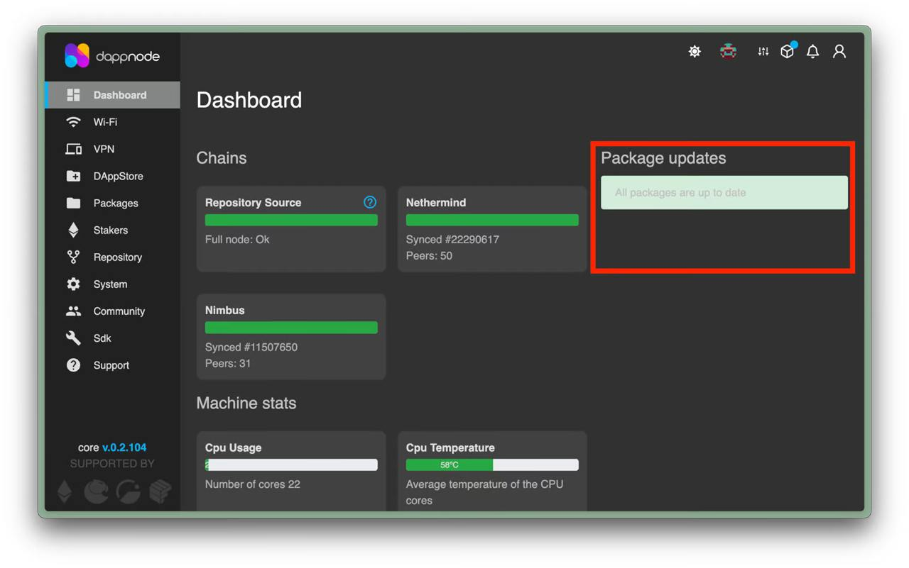

# Preparing for Pectra

## Core Clients: EL, CL, VC, MEV-Boost

### Eth Docker

```sh
ethd down
ethd update
ethd up
```

### EthPillar

Run `ethpillar`. Navigate to each client (EL, CL, VC, MEV-Boost) and select **"update to latest release"**

### Dappnode

Under **Dashboard,** available updates for each Package will be shown if auto-updates are not enabled. Update EL, CL, VC, MEV-Boost clients to the latest versions.

<figure><figcaption></figcaption></figure>

### Systemd

Follow the respective guides in this section to download and run the latest client versions.


[.](./)


## SSV

### ssv-stack Users

```sh
cd ~/ssv-stack #change the file path according to your ssv directory
docker pull ssvlabs/ssv-node:v2.3.1
docker compose down && docker compose up -d
```

### Eth Docker Users

```
ethd down
ethd update
ethd up
```

## Obol

### Obol CDVN Users

```sh
cd ~/charon-distributed-validator-node #change the file path according to your ssv directory
docker compose down
git stash
git pull
git checkout v0.1.16
git stash apply
docker compose up -d
```

### Eth Docker Users

```
ethd down
ethd update
ethd up
```
